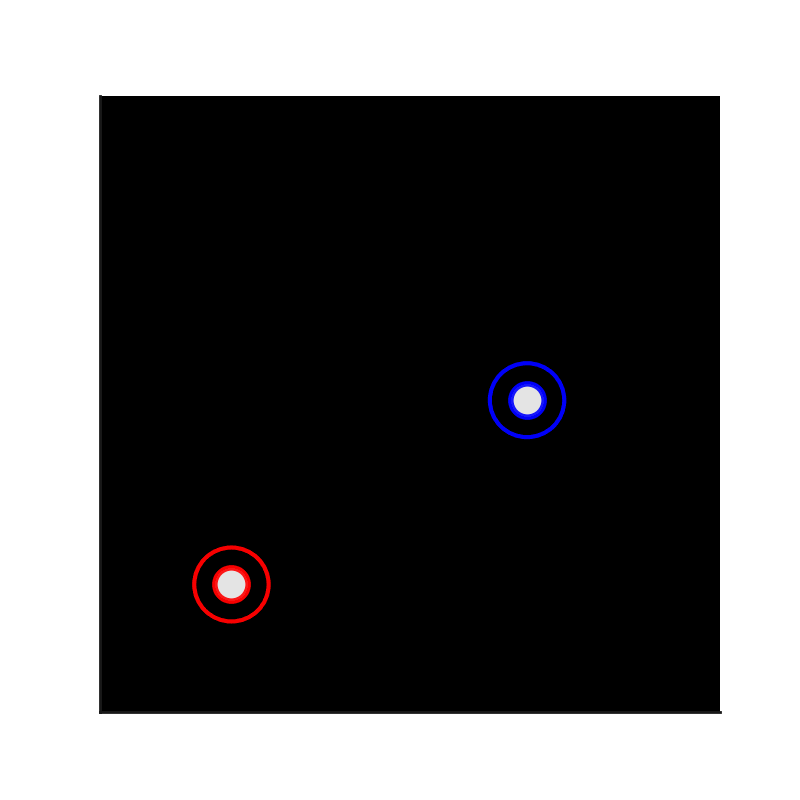

<!--
*** Thanks for checking out the SPT_Matlab. If you have a suggestion
*** that would make this better, please fork the repo and create a pull request
*** or simply open an issue with the tag "enhancement".
*** 
*** I imagine a world where scientific knowledge provides solutions for every health challenge, enabling everyone to live with autonomy, freedom, and well-being.
*** I created this project so that I might streamline taking raw microscopy data in my PhD and convert that in biological insights that might aid understanding the next generation of engineered T cell immunotherapies.
*** I hope this could be useful to a few future scienctist in whatever pursuit they are taking on. 
*** I would be overjoyed to help enable you to make discoveries and share knowlegde with humanity.
-->

<!-- PROJECT LOGO -->   
    <h3 align="center"> Single-Particle Tracking in Matlab (SPT_Matlab)</h3> 
 A MATLAB-based workflow for single-particle tracking that is for data relatively free of structured background   <a href="https://github.com/kscrudders/SPT_Matlab"><strong>Explore the docs »</strong></a>     <a href="https://github.com/kscrudders/SPT_Matlab/issues">Report Bug</a> · <a href="https://github.com/kscrudders/SPT_Matlab/issues">Request Feature</a> 
 
 <!-- TABLE OF CONTENTS --> 
 
Table of Contents
 <ol> <li><a href="#about-the-project">About The Project</a></li> <li><a href="#key-features">Key features</a></li> <li><a href="#built-with">Built With</a></li> <li><a href="#getting-started">Getting Started</a> <ul> <li><a href="#prerequisites">Prerequisites</a></li> <li><a href="#installation">Installation</a></li> </ul> </li> <li><a href="#usage">Usage</a></li> <li><a href="#roadmap">Roadmap</a></li> <li><a href="#contributing">Contributing</a></li> <li><a href="#license">License</a></li> <li><a href="#contact">Contact</a></li> <li><a href="#acknowledgments">Acknowledgments</a></li> </ol> 
 <!-- ABOUT THE PROJECT -->
## About The Project:
Single-particle tracking for sparse single-molecule data in MATLAB. Similar to TrackMate, but script-driven and stripped to essentials for supported lipid bilayers and other low-structure backgrounds. Works tolerably with mild cellular background. Performs poorly in strongly structured cellular backgrounds, like most classical pipelines.

## Key features:

* Detection: Laplacian-of-Gaussian (LoG) spot detection.
* Optional Auto thresholding (core idea): Assumes sparse signal so the LoG “quality” distribution is dominated by false positives. Then fits a log-logistic to the quality scores and sets the cutoff at the 99.5% CDF. This yields a robust, parameter-light detector.
* Localization: CUDA-accelerated subpixel fitting, inspired by (Smith et al., Nat Methods 2010, doi:10.1038/nmeth.1449).
* Linking: Greedy nearest-neighbour assignment solved with with a Jonker–Volgenant LAP appoach for frame-to-frame associations
* Diffusion-aware constraint: Optional frame linking constraint using expected diffusion and imaging interval (instead of a fixed value calculated by user), the tracker sets maxDisp to the 95th percentile step from a 2D Brownian Rayleigh model.
* Outputs for analysis and visualization: Spots table (CSV), track structures, and a results MAT file. Optional overlays and videos.

(<a href="#readme-top">back to top</a>)
 <!-- BUILT WITH -->

## Built With:
* Matlab vR2025a/b
* Curve Fitting Toolbox
* Optimization Toolbox
* Image Processing Toolbox
* Statistics and Machine Learning Toolbox
	
External Supporting Matlab scripts:
* raw image file importer of your choice

Incompatabilities:
* none currently known

(<a href="#readme-top">back to top</a>)
 <!-- GETTING STARTED -->

## Getting Started:
These instructions will guide you in preparing your local environment to run Basic_Usage.m.

## Prerequisites:
* MATLAB (R2019b or newer recommended)
* Above toolboxs

## Installation:
* Clone the repository:
* sh
* Copy
* Edit
* git clone https://github.com/kscrudders/SPT_Matlab.git

Add to MATLAB path:
* Open MATLAB.
* Go to Home > Set Path > Add with Subfolders and select the cloned folder.

(<a href="#readme-top">back to top</a>)
 <!-- USAGE EXAMPLES -->

## Usage:
* In MATLAB, open Basic_Usage.m.
* Import the data you want to track.
* Setup localization and tracking parameters
* Track data
* Check output and repeat!

(<a href="#readme-top">back to top</a>)
 <!-- ROADMAP -->

## Roadmap:

- [] Automated background and shade corrections
- [] Additional integration with alternative localization algorithms

See the [open issues](https://github.com/kscrudders/SPT_Matlab/issues) for a full list of proposed features (and known issues).

(<a href="#readme-top">back to top</a>)
 <!-- CONTRIBUTING -->

## Contributing:
Contributions make this script more robust and easier to use. If you have suggestions:
* Fork the Project
* Create your Feature Branch (git checkout -b feature/YourFeature)
* Commit your Changes (git commit -m 'Added an awesome feature')
* Push to the Branch (git push origin feature/YourFeature)
* Open a Pull Request

(<a href="#readme-top">back to top</a>)
 <!-- LICENSE -->

References: 

* Fast, single-molecule localization that achieves theoretically minimum uncertainty - Carlas S Smith, Nikolai Joseph, Bernd Rieger & Keith A Lidke - https://www.nature.com/articles/nmeth.1449
* LAPJV Jonker-Volgenant Algorithm for Linear Assignment Problem V3.0 - https://www.mathworks.com/matlabcentral/fileexchange/26836-lapjv-jonker-volgenant-algorithm-for-linear-assignment-problem-v3-0
* Faster Jonker-Volgenant - https://www.mathworks.com/matlabcentral/fileexchange/30838-faster-jonker-volgenant-assignment-algorithm
* TrackMate 7: integrating state-of-the-art segmentation algorithms into tracking pipelines - Dmitry Ershov, Minh-Son Phan, Joanna W. Pylvänäinen, Stéphane U. Rigaud, Laure Le Blanc, Arthur Charles-Orszag, James R. W. Conway, Romain F. Laine, Nathan H. Roy, Daria Bonazzi, Guillaume Duménil, Guillaume Jacquemet & Jean-Yves Tinevez - https://doi.org/10.1038/s41592-022-01507-1

Assignment solver: Jonker–Volgenant LAP (see MATLAB File Exchange entry referenced in code/comments).

## License:
This project is distributed under GNU General Public License. 

See LICENSE.txt for details.

(<a href="#readme-top">back to top</a>)
 <!-- CONTACT -->

## Contact:
Kevin Scrudders – kscrudders@gmail.com

Project Link: https://github.com/kscrudders/SPT_Matlab

(<a href="#readme-top">back to top</a>)
 <!-- ACKNOWLEDGMENTS -->

## Acknowledgments:
* The lab of Dr. Shalini T. Low-Nam
* The ever excellent MathWorks Documentation
* The code was developed from 2025. Most sections were drafted using ChatGPT and Gemini. All code was reviewed, stress tested, and approved by me, Kevin.
* Code outputs were compared to TrackMate outputs. 

(<a href="#readme-top">back to top</a>)

